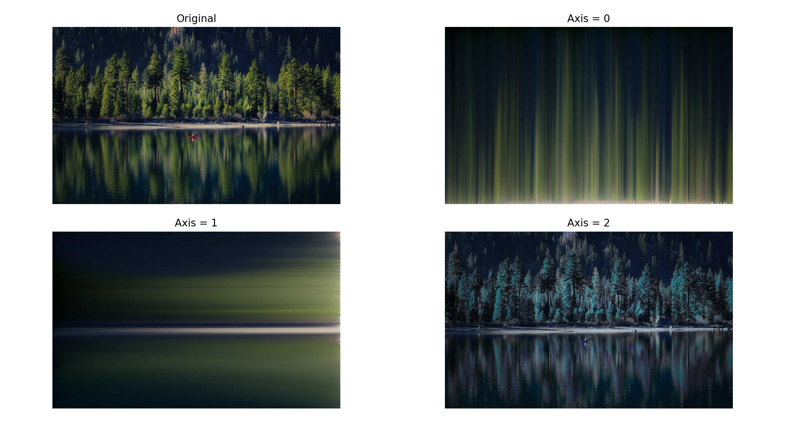

<h1 align="center">⛏ Quinque</h1>

Fun image manipulation experiments with Python

Made by <a href="http://rish-16.github.io"><strong>Rishabh Anand</strong></a>

    

---

## What is this?

`Quinque` is a collection of fun, interesting image manipulation experiments created using Python. I use `numpy`, `opencv`, `tensorflow`, and more to generate funky remakes of raw images.

## License

[MIT]()https://github.com/rish-16/Quinque/blob/master/LICENSE